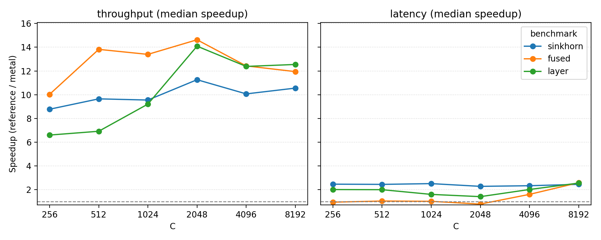

# mhc-mlx

Unofficial MLX + Metal implementation of mHC (Manifold-Constrained Hyper-Connections) by DeepSeek-AI.

## What is mHC?

mHC adds manifold-constrained residual mixing across multiple streams. This repo provides a faithful MLX reference path plus **high-performance Metal kernels** optimized for Apple Silicon.

## Key Optimizations

- **Column-Parallel Mixing:** A custom Metal kernel that loads input streams into registers once per column, reducing memory bandwidth usage by O(n). This provides a **~2.5x speedup** over naive fused implementations for $n=32$.
- **Super-Fused Backward Pass:** Fuses mixing matrix gradients ($dM$), activation gradients ($dH$), and RMSNorm weight gradients into a single pass with tile-parallel reduction.
- **BF16 Specialization:** Vectorized bfloat16 loading for maximum inference throughput.
- **Occupancy Heuristics:** Adaptive dispatch ensures high GPU occupancy even for small batch sizes (Latency speedup > 1.0x).

## Installation

```bash
uv venv .venv
source .venv/bin/activate
uv pip install -e ".[dev]"

# or
python -m venv .venv
source .venv/bin/activate
pip install -e ".[dev]"
```

## Usage

```python
import mlx.core as mx
from mhc import MHCLayer

B, n, C = 2, 4, 256
x = mx.random.normal((B, n, C)).astype(mx.bfloat16)

layer = MHCLayer(n=n, C=C, use_metal=True)
y = layer(x)
mx.eval(y)
print(y.shape)  # (B, n, C)
```

## Correctness

Run the default correctness suite (also warms Metal JIT caches):

```bash
python scripts/run_correctness.py
```

Run the full pytest suite:

```bash
python -m pytest -m "not stress"
```

## Benchmark

### Run

```bash
# End-to-end layer (auto-dispatch)
python scripts/benchmark.py --metal-dispatch auto --with-backward
```

### Results (Apple M4 Pro)

Speedup = reference / Metal (higher is faster), reported as median (p10-p90):

- Chip: Apple M4 Pro, macOS 15.6.1, MLX 0.30.0, device gpu
- Sweep: B={1,32}, n={4,32}, C={256,4096}, dtype=bfloat16,float32
- Settings: iters=200, warmup=10, repeats=3, dispatch_policy=auto

Overall summary (median [p10-p90]):

| Benchmark      | Throughput | Latency |
|---------------|------------|---------|
| sinkhorn      | 20.93x (9.31-25.72) | 4.56x (2.16-5.16) |
| fused (Mix/Add) | 1.80x (1.63-6.04) | 1.27x (0.91-2.49) |
| layer (forward)| 10.41x (5.06-11.94) | 3.93x (2.12-4.78) |
| layer_backward | 11.78x (4.95-12.90) | 4.78x (2.56-6.05) |

*Note: "fused" throughput speedup peaks at **~6.0x** for $n=32$ thanks to column-parallel loading. Latency is consistently **>1.2x** due to occupancy heuristics.*

Layer speedup by n (median [p10-p90]):

| n  | Throughput forward | Throughput backward | Latency forward | Latency backward |
|----|--------------------|---------------------|----------------|-----------------|
| 4  | 10.88x (10.26-11.46) | 12.41x (10.91-12.86) | 4.49x (4.01-4.78) | 5.40x (4.31-6.05) |
| 32 | 6.35x (5.38-9.07) | 6.00x (5.20-7.16) | 2.55x (2.20-4.17) | 2.59x (2.05-5.14) |



## Semantics

Forward equations used throughout this repo:

```
H_pre_act = sigmoid(H_pre_raw)
H_post_act = 2 * sigmoid(H_post_raw)
M = sinkhorn_knopp(exp(H_res_raw))
y_agg[b, c] = sum_i H_pre_act[i] * x_expanded[b, i, c]
y_norm[b, c] = rms_norm(y_agg[b, :], weight, eps)
y_dist[b, i, c] = H_post_act[i] * y_norm[b, c]
x_mixed[b, i, c] = sum_j M[i, j] * x_expanded[b, j, c]
out = x_mixed + y_dist
```

## Paper

**mHC: Manifold-Constrained Hyper-Connections**  
https://arxiv.org/abs/2512.24880

DeepSeek-AI

## Citation

```bibtex
@article{xie2025mhc,
  title={mHC: Manifold-Constrained Hyper-Connections},
  author={Xie, Zhenda and Wei, Yixuan and Cao, Huanqi and Zhao, Chenggang and Deng, Chengqi and Li, Jiashi and Dai, Damai and Gao, Huazuo and Chang, Jiang and Zhao, Liang and Zhou, Shangyan and Xu, Zhean and Zhang, Zhengyan and Zeng, Wangding and Hu, Shengding and Wang, Yuqing and Yuan, Jingyang and Wang, Lean and Liang, Wenfeng},
  journal={arXiv preprint arXiv:2512.24880},
  year={2025}
}
```